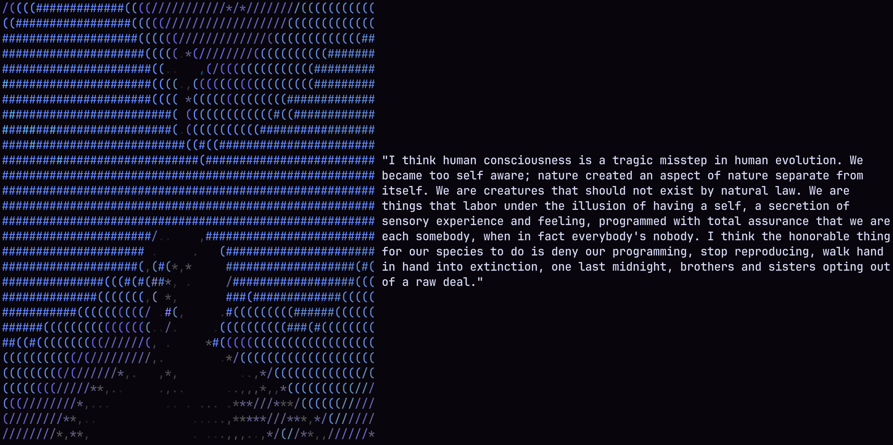

## COHLE
Rust CLI that prints Rust Cohle quotes.



**Install:**
```sh
# cargo
cargo install --git https://github.com/ShettySach/cohle
```

```nix
# nix
inputs = {
  cohle.url = "github:shettysach/cohle";
  cohle.inputs.nixpkgs.follows = "nixpkgs";
};

environment.systemPackages = lib.attrValues {
    cohle = inputs.cohle.packages.${pkgs.system}.default;
};
```

**Usage**: 
```sh
cohle [OPTIONS] [QUOTE_INDEX] [COMMAND]
```

```
Cohle: Rust CLI that prints Rust Cohle quotes.

Usage: cohle [OPTIONS] [QUOTE_INDEX] [COMMAND]

Commands:
  quote  Print only quote without image
  image  Print only image without quote
  list   Lists all the quotes and colours along with their indices
  help   Print this message or the help of the given subcommand(s)

Arguments:
  [QUOTE_INDEX]  Index of the quote, defaults to random [default: 18]

Options:
  -c, --colour <COLOUR>  Colour of quote [default: w]
  -b, --bold             Print quote in bold
  -i, --italic           Print quote italicised
  -g, --background       Print image with black background
  -h, --help             Print help
```
